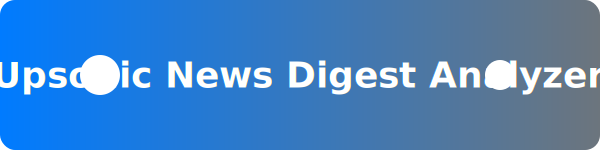
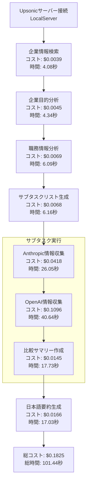

<p align="center">
  
</p>

<h1 align="center">📰 Upsonicニュース要約サンプル</h1>

このプロジェクトは、Upsonicフレームワークを使用して、ニュース記事を要約する基本的なサンプルです。

## 🚀 概要

このサンプルでは、Upsonicの基本的な機能であるLLM呼び出しを使用して、指定されたトピックに関する最新のニュース記事を検索し、要約します。

## 🛠️ 使い方

1. 必要なパッケージをインストールします:

    ```bash
    pip install python-dotenv upsonic
    ```

2. `.env`ファイルを作成し、OpenAI APIキーを設定します:

    ```bash
    OPENAI_API_KEY=your_api_key_here
    ```

3. 以下のコマンドを実行して、サンプルコードを実行します:

    ```bash
    python main.py
    ```

## 💻 コードの解説

### 環境設定
```python
from dotenv import load_dotenv
import os

# 環境変数の読み込み
load_dotenv()

# APIキーの取得
api_key = os.getenv("OPENAI_API_KEY")
if not api_key:
    raise ValueError("OPENAI_API_KEYが設定されていません。.envファイルを確認してください。")
```
- `python-dotenv`を使用して`.env`ファイルから環境変数を読み込み
- APIキーの存在チェックを行い、未設定の場合はエラーを表示

### クライアントの初期化
```python
from upsonic import UpsonicClient, ObjectResponse, Task, AgentConfiguration
from upsonic.client.tools import Search

client = UpsonicClient("localserver")
client.set_config("OPENAI_API_KEY", api_key)
```
- `UpsonicClient`を使用してローカルサーバーに接続
- 環境変数から取得したAPIキーを設定

### タスクの定義
```python
task = Task(description="AnthropicとOpenAIの最新ニュースを調査する", tools=[Search])
```
- `Task`オブジェクトを作成し、ニュース調査の目的を設定
- `Search`ツールを利用可能なツールとして指定

### エージェントの設定
```python
product_manager_agent = AgentConfiguration(
    job_title="プロダクトマネージャー",
    company_url="https://upsonic.ai",
    company_objective="人々がタスクを完了するのを助けるAIエージェントフレームワークを構築する",
)
```
- エージェントの役割と組織のコンテキストを定義
- プロダクトマネージャーの視点でニュースを分析

### タスクの実行
```python
client.agent(product_manager_agent, task)
result = task.response
print(result)
```
- 設定したエージェントにタスクを実行させる
- タスクの結果を取得して表示

## ⚙️ 処理フローと実行ログ

### 実行環境
- コマンド: `python3 main.py`
- 環境: ローカル環境

### 処理フロー



- このフローチャートは、コードの実行順序を可視化したものです。
- 各ステップは、UpsonicクライアントがLLMを呼び出し、結果を生成するプロセスを表しています。

### 実行ログ

1. **Upsonicサーバーへの接続**:
   - コード実行開始時に、Upsonicクライアントがローカルサーバーへの接続を確立します。

   ```log
   ╭─────────────────── Upsonic - Server Connection ────────────────────╮
   │  Server Type:                  Local(LocalServer)                  │
   │  Connection Status:            ✓ Established                       │
   ╰────────────────────────────────────────────────────────────────────╯
   ```

2. **LLM呼び出し (1回目: 企業情報)**:
   -  `client.agent(product_manager_agent, task)` が実行されると、最初のエージェント呼び出しが行われます。
   -  この呼び出しで、LLMはUpsonic.aiに関する企業情報を分析し、`CompanyObjective` 形式で結果を生成します。

   ```log
   ╭────────────────────── Upsonic - Call Result ───────────────────────╮
   │  LLM Model:          claude/claude-3-5-sonnet                      │
   │  Company Objective:  Enter and establish a strong presence         │
   │                      in the Enterprise AI market by                │
   │                      providing comprehensive AI solutions          │
   │                      and development tools                         │
   │  Response Format:    CompanyObjective                              │
   │  Estimated Cost:     ~0.0045$                                      │
   │  Time Taken:         4.34 seconds                                  │
   ╰────────────────────────────────────────────────────────────────────╯
   ```
   - ログから、`claude/claude-3-5-sonnet` モデルが使用され、処理に4.34秒かかったことがわかります。

3. **LLM呼び出し (2回目: 職務情報)**:
   -  続いて、プロダクトマネージャーの職務に関する情報が `HumanObjective` 形式で生成されます。

   ```log
   ╭────────────────────── Upsonic - Call Result ───────────────────────╮
   │  LLM Model:        claude/claude-3-5-sonnet                        │
   │  Job Title:        プロダクトマネージャー (Product Manager)        │
   │  Job Description:  ... (職務記述) ...                             │
   │  Response Format:  HumanObjective                                  │
   │  Estimated Cost:   ~0.0069$                                        │
   │  Time Taken:       6.09 seconds                                    │
   ╰────────────────────────────────────────────────────────────────────╯
   ```
   -  ここでも `claude/claude-3-5-sonnet` モデルが使用され、6.09秒で処理されています。

4. **LLM呼び出し (3回目: サブタスクリスト)**:
   -  タスクがサブタスクに分割され、`SubTaskList` 形式でリストアップされます。

   ```log
   ╭────────────────────── Upsonic - Call Result ───────────────────────╮
   │  LLM Model:        claude/claude-3-5-sonnet                        │
   │  Total Subtasks:   3                                               │
   │  Subtask:          Search for the latest news about                │
   │                    Anthropic                                       │
   │  Required Output:  Recent news, developments, and updates          │
   │  Tools:            ['Search__google',                              │
   │                    'Search__read_website']                         │
   │  Response Format:  SubTaskList                                     │
   │  Estimated Cost:   ~0.0068$                                        │
   │  Time Taken:       6.16 seconds                                    │
   ╰────────────────────────────────────────────────────────────────────╯
   ```
   -  3つのサブタスク（AnthropicとOpenAIのニュース検索、比較サマリー作成）が定義され、各サブタスクに必要なツールも指定されています。

5. **LLM呼び出し (4回目 & 5回目: エージェント結果 - Anthropic & OpenAI)**:
   -  各サブタスクが実行され、AnthropicとOpenAIそれぞれの最新ニュースに関するエージェントの結果が `str` 形式で生成されます。

   ```log
   ╭────────────────────── Upsonic - Agent Result ──────────────────────╮
   │  LLM Model:        claude/claude-3-5-sonnet                        │
   │  Result:           Based on the search results, here are           │
   │                    the latest major developments about             │
   │                    Anthropic:                                      │
   │                    ... (Anthropicのニュース要約) ...               │
   │  Response Format:  str                                             │
   │  Estimated Cost:   ~0.0418$                                        │
   │  Time Taken:       26.05 seconds                                   │
   ╰────────────────────────────────────────────────────────────────────╯

   ╭────────────────────── Upsonic - Agent Result ──────────────────────╮
   │  LLM Model:        claude/claude-3-5-sonnet                        │
   │  Result:           Based on the search results and                 │
   │                    available information, here are the             │
   │                    latest major developments about                 │
   │                    OpenAI:                                         │
   │                    ... (OpenAIのニュース要約) ...                  │
   │  Response Format:  str                                             │
   │  Estimated Cost:   ~0.1096$                                        │
   │  Time Taken:       40.64 seconds                                   │
   ╰────────────────────────────────────────────────────────────────────╯
   ```
   -  Anthropicのニュース要約には26.05秒、OpenAIのニュース要約には40.64秒かかっています。

6. **LLM呼び出し (6回目 & 7回目: エージェント結果 - 比較サマリー & 日本語要約)**:
   -  最後に、AnthropicとOpenAIの比較サマリーと、日本語での要約が `str` 形式で生成されます。

   ```log
   ╭────────────────────── Upsonic - Agent Result ──────────────────────╮
   │  LLM Model:        claude/claude-3-5-sonnet                        │
   │  Result:           I'll help you compile a comprehensive           │
   │                    comparative summary ...                         │
   │                    Comparative Summary of Latest                   │
   │                    Developments: Anthropic vs OpenAI (as           │
   │                    of January 2025)                                │
   │                    ... (比較サマリー) ...                           │
   │  Response Format:  str                                             │
   │  Estimated Cost:   ~0.0145$                                        │
   │  Time Taken:       17.73 seconds                                   │
   ╰────────────────────────────────────────────────────────────────────╯

   ╭────────────────────── Upsonic - Agent Result ──────────────────────╮
   │  LLM Model:        claude/claude-3-5-sonnet                        │
   │  Result:           以前の調査結果から、AnthropicとOpenA…           │
   │                    ... (日本語要約) ...                             │
   │  Response Format:  str                                             │
   │  Estimated Cost:   ~0.0166$                                        │
   │  Time Taken:       17.03 seconds                                   │
   ╰────────────────────────────────────────────────────────────────────╯
   ```
   -  比較サマリー生成には17.73秒、日本語要約生成には17.03秒かかっています。

7. **Upsonicエージェントの合計コスト**:
   -  最後に、Upsonicエージェントの合計コストと実行時間がログに出力されます。

   ```log
   ╭──────────────────── Upsonic - Agent Total Cost ────────────────────╮
   │  Estimated Cost:                ~0.1825$                           │
   │  Time Taken:                    101.44 seconds                     │
   ╰────────────────────────────────────────────────────────────────────╯
   ```
   -  合計コストは約0.1825ドル、合計実行時間は101.44秒です。

### コードの挙動

このコードは、Upsonicフレームワークを使用して、AnthropicとOpenAIの最新ニュースを検索し、プロダクトマネージャーの視点から分析します。
1.  `.env`ファイルからAPIキーを読み込み、Upsonicクライアントを初期化します。
2.  ニュース検索タスクを定義し、プロダクトマネージャーのエージェントを設定します。
3.  設定したエージェントにタスクを実行させ、以下の処理フローで結果をコンソールに出力します。
    - Upsonicサーバーへの接続を確立
    - LLMを複数回呼び出し、企業情報、職務情報、サブタスクリスト、エージェント結果（Anthropic、OpenAI、比較サマリー、日本語要約）を生成
    - 最後に、Upsonicエージェントの合計コストと実行時間をログ出力

## 🔍 主な機能

1. **ニュース検索**: 指定されたトピック(AnthropicとOpenAI)に関する最新ニュースを検索
2. **情報分析**: プロダクトマネージャーの視点での記事の分析
3. **結果出力**: 分析結果の要約とレポート生成

## 📚 参考資料

- [Upsonic 公式ドキュメント](https://upsonic.ai)
- [python-dotenv ドキュメント](https://github.com/theskumar/python-dotenv)
